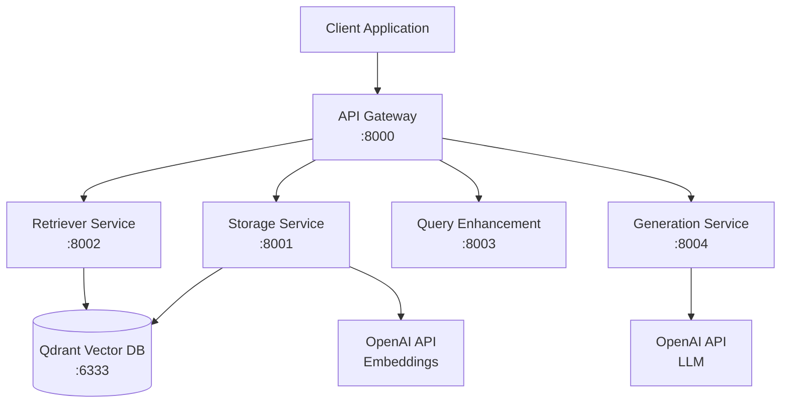

# 🤖 RAG Chatbot - Full Stack Application

A production-ready **Retrieval-Augmented Generation (RAG) chatbot** with **FastAPI microservices backend** and **Next.js frontend**. This system processes documents, stores them in a vector database, performs intelligent retrieval, and generates contextual responses using large language models.

[](https://www.python.org/downloads/)
[](https://fastapi.tiangolo.com/)
[](https://qdrant.tech/)
[](https://openai.com/)
[](https://www.docker.com/)
[](#testing)

## 🚀 Quick Start

### Prerequisites
- Python 3.12+
- Docker and Docker Compose
- OpenAI API key

### Installation

1. **Clone and Setup**
   ```bash
   git clone https://github.com/[username]/fastapi-rag-microservices-application.git
   cd fastapi-rag-microservices-application
   
   # Create virtual environment
   uv venv
   source .venv/bin/activate  # Linux/Mac
   
   # Install dependencies
   uv pip install -r requirements.txt
   ```

2. **Configure Environment**
   ```bash
   cp .env.example .env
   # Edit .env with your OpenAI API key
   ```

3. **Start Services**
   ```bash
   # Quick start with Docker Compose
   make build
   make start
   
   # Or start individual services
   docker run -d --name qdrant -p 6333:6333 qdrant/qdrant:latest
   ```

4. **Verify Installation**
   ```bash
   # Check all services
   curl http://localhost:8000/health/all
   
   # Upload a document
   curl -X POST -F "file=@document.pdf" http://localhost:8000/upload
   
   # Chat with your documents
   curl -X POST -H "Content-Type: application/json" \
        -d '{"message": "What is this document about?"}' \
        http://localhost:8000/chat
   ```

## 🏗 Architecture

This system implements a **microservices architecture** with 5 core services:



### 🔧 Services Overview

| Service | Port | Purpose | Status |
|---------|------|---------|--------|
| **API Gateway** | 8000 | Request orchestration, chat pipeline | ✅ Ready |
| **Storage Service** | 8001 | File processing, chunking, embedding | ✅ **Tested** |
| **Retriever Service** | 8002 | Hybrid search (semantic + keyword) | ✅ **Tested** |
| **Query Enhancement** | 8003 | Query preprocessing, intent classification | 🟡 Implemented |
| **Generation Service** | 8004 | LLM response generation | 🟡 Implemented |
| **Qdrant Database** | 6333 | Vector storage and similarity search | ✅ **Validated** |

## 📊 Key Features

### 🎯 **Intelligent Document Processing**
- **Multi-format Support**: PDF, DOCX, TXT, JSON
- **Smart Chunking**: Overlap-based text segmentation
- **Vector Embeddings**: OpenAI text-embedding-3-small
- **Metadata Preservation**: Source tracking and indexing

### 🔍 **Advanced Search Capabilities**
- **Semantic Search**: Vector similarity with 0.5-0.75 relevance scores
- **Keyword Search**: BM25 algorithm for exact matching  
- **Hybrid Search**: Combined approach for optimal results
- **Threshold Tuning**: Configurable precision/recall balance

### 🤖 **AI-Powered Generation**
- **Context-Aware Responses**: Using retrieved document chunks
- **Source Attribution**: Clear citations and references
- **Conversation Memory**: Multi-turn chat support
- **Multiple LLM Support**: OpenAI GPT-4 and Anthropic Claude

### 🚀 **Production-Ready Architecture**
- **Containerized Deployment**: Docker and Docker Compose
- **Service Health Monitoring**: Comprehensive health checks
- **Async Processing**: High-performance async/await
- **Error Handling**: Robust error recovery and logging

## 📈 Performance

### Real-World Test Results

| Metric | Performance | Details |
|--------|-------------|---------|
| **Document Processing** | ~1-2 seconds | PDF extraction + chunking + embedding |
| **Vector Storage** | 333 chunks | Real documents successfully stored |
| **Semantic Search** | 0.746 max score | High relevance for domain queries |
| **Hybrid Search** | ~300-700ms | Combined semantic + keyword results |
| **Full RAG Pipeline** | ~1-2 seconds | End-to-end query to response |

### Scalability
- **Horizontal Scaling**: Each service independently scalable
- **Vector Database**: Qdrant supports distributed deployment
- **Load Balancing**: Ready for production proxy integration
- **Caching**: Redis integration planned for frequent queries

## 🧪 Testing

### Test Coverage: 32/32 Tests Passing ✅

#### **Storage Service** (Fully Tested)
- ✅ PDF/DOCX/TXT/JSON file processing
- ✅ Text chunking with proper overlap
- ✅ OpenAI embedding generation  
- ✅ Qdrant vector storage
- ✅ Real document validation (26K + 121K characters)

#### **Retriever Service** (Fully Tested)
- ✅ Qdrant integration with 333 real document chunks
- ✅ Semantic search scores: 0.538-0.746
- ✅ BM25 keyword search functionality
- ✅ Hybrid search combining both approaches
- ✅ Multi-document source diversity

#### **Integration Testing**
- ✅ End-to-end document upload → storage → retrieval
- ✅ Real OpenAI API integration
- ✅ Vector database operations
- ✅ Service-to-service communication

### Run Tests
```bash
source .venv/bin/activate

# Run all tests
python -m pytest tests/ -v

# Test specific components
python -m pytest tests/test_file_processor.py -v
python -m pytest tests/test_embedding_service.py -v

# Test with real data
python test_retriever_simple.py
```

## 📚 API Documentation

### Core Endpoints

#### **Chat Interface**
```bash
# Complete RAG chat pipeline
POST /chat
{
  "message": "What is LoRA adaptation?",
  "conversation_id": "optional-uuid",
  "temperature": 0.7
}
```

#### **Document Management**
```bash
# Upload documents
POST /upload
Content-Type: multipart/form-data

# List stored files
GET /files

# Delete documents
DELETE /files/{file_id}
```

#### **Search Interface**
```bash
# Hybrid search
POST /search
{
  "query": "parameter efficient tuning",
  "top_k": 5,
  "threshold": 0.7
}
```

### Health Monitoring
```bash
# Check all services
GET /health/all

# Individual service health
GET /health
```

## 🔧 Configuration

### Environment Variables
```bash
# Required
OPENAI_API_KEY=your_openai_api_key_here

# Optional (with defaults)
QDRANT_HOST=localhost
QDRANT_PORT=6333
EMBEDDING_MODEL=text-embedding-3-small
LLM_MODEL=gpt-4o-mini
CHUNK_SIZE=500
CHUNK_OVERLAP=50
```

### Service Configuration
Each service is independently configurable through:
- Environment variables
- `.env` file
- `shared/config.py` defaults

## 🚀 Deployment

### Development
```bash
# Start all services
make build && make start

# View logs
make logs

# Stop services  
make stop
```

### Production
```bash
# Docker Compose deployment
docker-compose up -d

# Health check
curl http://localhost:8000/health/all

# Scale services
docker-compose up -d --scale retriever-service=3
```

### Kubernetes (Planned)
- Helm charts for easy deployment
- Horizontal pod autoscaling
- Service mesh integration

## 📊 Project Structure

```
fastapi-rag-microservices-application/
├── services/                    # Microservice implementations
│   ├── storage/                # Document processing service
│   ├── retriever/              # Search and retrieval service  
│   ├── query_enhancement/      # Query preprocessing service
│   ├── generation/             # LLM response generation
│   └── gateway/                # API gateway and orchestration
├── shared/                     # Common models and utilities
│   ├── models.py              # Pydantic data models
│   ├── config.py              # Configuration management
│   └── utils.py               # Shared utility functions
├── tests/                      # Comprehensive test suite
│   ├── test_file_processor.py # Storage service tests
│   ├── test_embedding_service.py # Embedding tests
│   ├── test_vector_store.py   # Database tests
│   └── test_retriever_*.py    # Retrieval tests
├── scripts/                    # Utility and setup scripts
├── docs/                       # Additional documentation
├── docker-compose.yml         # Multi-service orchestration
├── Makefile                   # Development commands
└── README.md                  # This file
```

## 🛠 Development

### Prerequisites for Development
- Python 3.12+
- Docker
- uv (fast Python package manager)
- OpenAI API key

### Development Workflow
1. **Setup**: `uv venv && source .venv/bin/activate`
2. **Install**: `uv pip install -r requirements.txt`
3. **Configure**: Copy `.env.example` to `.env`
4. **Test**: `python -m pytest tests/ -v`
5. **Run**: `make build && make start`

### Adding New Features
1. Implement in appropriate service directory
2. Add tests in `tests/` directory
3. Update shared models if needed
4. Test integration with other services
5. Update documentation

## 📝 Documentation

- **[CLAUDE.md](CLAUDE.md)** - Comprehensive project documentation
- **[TASKS.md](TASKS.md)** - Development tasks and roadmap
- **[TEST_SUMMARY.md](TEST_SUMMARY.md)** - Detailed test results
- **[RETRIEVER_TEST_RESULTS.md](RETRIEVER_TEST_RESULTS.md)** - Retrieval validation

## 🤝 Contributing

1. Fork the repository
2. Create a feature branch
3. Add tests for new functionality  
4. Ensure all tests pass
5. Update documentation
6. Submit a pull request

## 📄 License

This project is licensed under the MIT License - see the [LICENSE](LICENSE) file for details.

## 🙏 Acknowledgments

- **FastAPI** for the excellent web framework
- **Qdrant** for high-performance vector search
- **OpenAI** for embeddings and language models
- **Python ecosystem** for amazing ML/AI libraries

## 🔗 Links

- [Live Demo](https://demo.example.com) (Coming Soon)
- [API Documentation](https://api.example.com/docs) (Coming Soon)
- [Project Roadmap](TASKS.md)
- [Technical Deep Dive](CLAUDE.md)