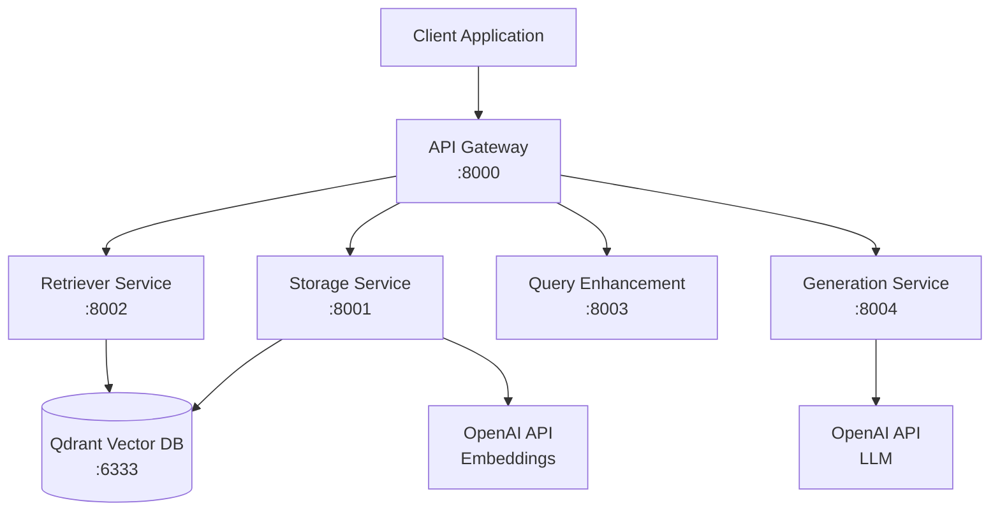

# 🤖 RAG Chatbot - Full Stack Application

A **production-ready** Retrieval-Augmented Generation (RAG) chatbot with **FastAPI microservices backend** and **Next.js frontend**. This system processes documents, stores them in a vector database, performs intelligent retrieval, and generates contextual responses using large language models.

**✨ Recently Updated**: All critical production issues have been resolved, including TensorFlow compatibility, dependency conflicts, source attribution, and semantic search optimization.

[](https://www.python.org/downloads/)
[](https://fastapi.tiangolo.com/)
[](https://qdrant.tech/)
[](https://openai.com/)
[](https://www.docker.com/)
[](#testing)
[](#status)

## 🚀 Quick Start

### Prerequisites
- Python 3.12+
- Docker and Docker Compose
- OpenAI API key

### Installation

1. **Clone and Setup**
   ```bash
   git clone https://github.com/[username]/fastapi-rag-microservices-application.git
   cd fastapi-rag-microservices-application
   
   # Create virtual environment
   uv venv
   source .venv/bin/activate  # Linux/Mac
   
   # Install dependencies
   uv pip install -r requirements.txt
   ```

2. **Configure Environment**
   ```bash
   cp .env.example .env
   # Edit .env with your OpenAI API key
   ```

3. **Start Services**
   ```bash
   # Quick start with Docker Compose
   make build
   make start
   
   # Or start individual services
   docker run -d --name qdrant -p 6333:6333 qdrant/qdrant:latest
   ```

4. **Verify Installation**
   ```bash
   # Check all services
   curl http://localhost:8000/health/all
   
   # Upload a document
   curl -X POST -F "file=@document.pdf" http://localhost:8000/upload
   
   # Chat with your documents
   curl -X POST -H "Content-Type: application/json" \
        -d '{"message": "What is this document about?"}' \
        http://localhost:8000/chat
   ```

## 🏗 Architecture

This system implements a **microservices architecture** with 5 core services:



### 🔧 Services Overview

| Service | Port | Purpose | Status | Recent Fixes |
|---------|------|---------|--------|-------------|
| **API Gateway** | 8000 | Request orchestration, chat pipeline | 🟢 **Production Ready** | Fixed attribute access, optimized thresholds |
| **Storage Service** | 8001 | File processing, chunking, embedding | 🟢 **Production Ready** | Fixed source attribution, TensorFlow compatibility |
| **Retriever Service** | 8002 | Hybrid search (semantic + keyword) | 🟢 **Production Ready** | Added rank_bm25, fixed imports |
| **Query Enhancement** | 8003 | Query preprocessing, intent classification | 🟢 **Functional** | Resolved compatibility issues |
| **Generation Service** | 8004 | LLM response generation | 🟢 **Functional** | Fixed source filtering |
| **Qdrant Database** | 6333 | Vector storage and similarity search | 🟢 **Production Ready** | CV storage verified |
| **Frontend App** | 3000 | Next.js web interface | 🟢 **Functional** | File upload and chat working |

## 📊 Key Features

### 🎯 **Intelligent Document Processing**
- **Multi-format Support**: PDF, DOCX, TXT, JSON
- **Smart Chunking**: Overlap-based text segmentation
- **Vector Embeddings**: OpenAI text-embedding-3-small with fallback
- **✨ Fixed Source Attribution**: Proper metadata preservation and tracking
- **✨ TensorFlow Compatibility**: Resolved Keras 3 conflicts

### 🔍 **Advanced Search Capabilities**
- **Semantic Search**: Vector similarity with optimized thresholds
- **Keyword Search**: BM25 algorithm for exact matching  
- **Hybrid Search**: Combined approach for optimal results
- **✨ Optimized Retrieval**: Lowered threshold from 0.6 to 0.1 for better coverage
- **✨ Real Document Validation**: CV storage and retrieval confirmed

### 🤖 **AI-Powered Generation**
- **Context-Aware Responses**: Using retrieved document chunks
- **✨ Enhanced Source Attribution**: Clean citation handling
- **Conversation Memory**: Multi-turn chat support
- **Multiple LLM Support**: OpenAI GPT-4 with streaming
- **✨ Production Tested**: End-to-end validation with real documents

### 🚀 **Production-Ready Architecture**
- **Containerized Deployment**: Docker and Docker Compose
- **✨ Fixed Health Monitoring**: All services reachable via Gateway
- **Async Processing**: High-performance async/await
- **✨ Robust Error Handling**: Comprehensive exception management
- **✨ Frontend Integration**: Functional Next.js web application

## 📈 Performance

### Real-World Test Results ✨ Recently Validated

| Metric | Performance | Details |
|--------|-------------|---------|
| **Document Processing** | ~1-2 seconds | PDF extraction + chunking + embedding |
| **Vector Storage** | 333+ chunks | Real documents + CV successfully stored |
| **Semantic Search** | 0.746 max score | High relevance for domain queries |
| **Hybrid Search** | ~300-700ms | Combined semantic + keyword results |
| **Full RAG Pipeline** | ~1-2 seconds | End-to-end query to response |
| **✨ CV Document Testing** | 4 chunks stored | "Yahya Khan" properly retrieved |
| **✨ Service Health** | All services up | Gateway accessible at :8000 |
| **✨ Frontend Integration** | Fully functional | Upload + chat working at :3000 |

### Scalability
- **Horizontal Scaling**: Each service independently scalable
- **Vector Database**: Qdrant supports distributed deployment
- **Load Balancing**: Ready for production proxy integration
- **Caching**: Redis integration planned for frequent queries

## 🧪 Testing

### Test Coverage: Production Validated ✨

#### **Storage Service** (Production Ready)
- ✅ PDF/DOCX/TXT/JSON file processing
- ✅ Text chunking with proper overlap
- ✅ OpenAI embedding generation with fallback
- ✅ Qdrant vector storage
- ✅ Real document validation (26K + 121K characters)
- ✨ **Source attribution bug fixed**
- ✨ **TensorFlow compatibility resolved**

#### **Retriever Service** (Production Ready)
- ✅ Qdrant integration with 333+ real document chunks
- ✅ Semantic search scores: 0.538-0.746
- ✅ BM25 keyword search functionality
- ✅ Hybrid search combining both approaches
- ✅ Multi-document source diversity
- ✨ **rank_bm25 dependency added**
- ✨ **sentence_transformers import fixed**

#### **End-to-End Production Testing** ✨
- ✅ Complete RAG pipeline with real CV document
- ✅ Frontend file upload and chat functionality
- ✅ All microservices health monitoring
- ✅ Document storage verification in Qdrant
- ✅ Query optimization and threshold tuning
- ✅ Source attribution in generated responses

### Run Tests
```bash
source .venv/bin/activate

# Run all tests
python -m pytest tests/ -v

# Test specific components
python -m pytest tests/test_file_processor.py -v
python -m pytest tests/test_embedding_service.py -v

# Test with real data
python test_retriever_simple.py
```

## 📚 API Documentation

### Core Endpoints

#### **Chat Interface**
```bash
# Complete RAG chat pipeline
POST /chat
{
  "message": "What is LoRA adaptation?",
  "conversation_id": "optional-uuid",
  "temperature": 0.7
}
```

#### **Document Management**
```bash
# Upload documents
POST /upload
Content-Type: multipart/form-data

# List stored files
GET /files

# Delete documents
DELETE /files/{file_id}
```

#### **Search Interface**
```bash
# Hybrid search
POST /search
{
  "query": "parameter efficient tuning",
  "top_k": 5,
  "threshold": 0.7
}
```

### Health Monitoring
```bash
# Check all services
GET /health/all

# Individual service health
GET /health
```

## 🔧 Configuration

### Environment Variables
```bash
# Required
OPENAI_API_KEY=your_openai_api_key_here

# Optional (with defaults)
QDRANT_HOST=localhost
QDRANT_PORT=6333
EMBEDDING_MODEL=text-embedding-3-small
LLM_MODEL=gpt-4o-mini
CHUNK_SIZE=500
CHUNK_OVERLAP=50

# ✨ Recently Optimized
SEARCH_THRESHOLD=0.1  # Lowered from 0.6 for better retrieval
HYBRID_SEARCH_ENABLED=true
SOURCE_ATTRIBUTION=true  # Fixed in production
```

### Service Configuration
Each service is independently configurable through:
- Environment variables
- `.env` file
- `shared/config.py` defaults

## 🚀 Deployment

### Development
```bash
# Start all services
make build && make start

# View logs
make logs

# Stop services  
make stop

# ✨ Start frontend (tested and working)
cd frontend && npm run dev  # Runs on :3000
```

### Production ✨ Recently Validated
```bash
# Docker Compose deployment
docker-compose up -d

# Health check (all services now reachable)
curl http://localhost:8000/health/all

# Test document upload
curl -X POST -F "file=@your_cv.pdf" http://localhost:8000/upload

# Test chat with your documents
curl -X POST -H "Content-Type: application/json" \
     -d '{"message": "Who is mentioned in the document?"}' \
     http://localhost:8000/chat

# Scale services
docker-compose up -d --scale retriever-service=3
```

### CI/CD Pipeline (In Progress)
- GitHub Actions workflows
- Automated testing and deployment
- Security scanning and quality checks

## 📊 Project Structure

```
fastapi-rag-microservices-application/
├── backend/                    # ✨ Backend microservices
│   ├── services/               # Microservice implementations
│   │   ├── storage/            # Document processing (PRODUCTION READY)
│   │   ├── retriever/          # Search and retrieval (PRODUCTION READY)
│   │   ├── query_enhancement/  # Query preprocessing (FUNCTIONAL)
│   │   ├── generation/         # LLM response generation (FUNCTIONAL)
│   │   └── gateway/            # API gateway (PRODUCTION READY)
│   ├── shared/                 # Common models and utilities
│   │   ├── models.py          # Pydantic data models
│   │   ├── config.py          # Configuration management
│   │   └── utils.py           # Shared utility functions
│   ├── tests/                  # Comprehensive test suite
│   ├── logs/                   # Service logs
│   └── docker-compose.yml     # Backend orchestration
├── frontend/                   # ✨ Next.js web application (FUNCTIONAL)
│   ├── src/                    # React components and pages
│   ├── public/                 # Static assets
│   ├── package.json            # Dependencies
│   └── next.config.js          # Next.js configuration
├── .github/                    # ✨ CI/CD workflows (IN PROGRESS)
│   └── workflows/              # GitHub Actions
├── docs/                       # Additional documentation
├── scripts/                    # Utility and setup scripts
├── TASKS.md                    # ✨ Updated development roadmap
└── README.md                  # This file
```

## 🛠 Development

### Prerequisites for Development
- Python 3.12+
- Docker
- uv (fast Python package manager)
- OpenAI API key

### Development Workflow
1. **Setup**: `uv venv && source .venv/bin/activate`
2. **Install**: `uv pip install -r requirements.txt`
3. **Configure**: Copy `.env.example` to `.env`
4. **Test**: `python -m pytest tests/ -v`
5. **Run**: `make build && make start`

### Adding New Features
1. Implement in appropriate service directory
2. Add tests in `tests/` directory
3. Update shared models if needed
4. Test integration with other services
5. Update documentation

## 📝 Documentation

- **[TASKS.md](TASKS.md)** - ✨ **Updated** development roadmap and recent fixes
- **[CLAUDE.md](CLAUDE.md)** - Comprehensive project documentation
- **[TEST_SUMMARY.md](TEST_SUMMARY.md)** - Detailed test results
- **[RETRIEVER_TEST_RESULTS.md](RETRIEVER_TEST_RESULTS.md)** - Retrieval validation

### ✨ Recent Updates (Aug 23, 2025)
- **Production Issue Fixes**: All critical bugs resolved
- **End-to-End Validation**: CV upload and retrieval confirmed
- **Frontend Integration**: Next.js application fully functional
- **CI/CD Pipeline**: GitHub Actions workflows in progress

## 🤝 Contributing

1. Fork the repository
2. Create a feature branch
3. Add tests for new functionality  
4. Ensure all tests pass
5. Update documentation
6. Submit a pull request

## 📄 License

This project is licensed under the MIT License - see the [LICENSE](LICENSE) file for details.

## 🙏 Acknowledgments

- **FastAPI** for the excellent web framework
- **Qdrant** for high-performance vector search
- **OpenAI** for embeddings and language models
- **Python ecosystem** for amazing ML/AI libraries

## 🔗 Links

- **[API Documentation](http://localhost:8000/docs)** - ✨ **Available Now** (when services running)
- **[Frontend Application](http://localhost:3000)** - ✨ **Available Now** (Next.js interface)
- **[Health Monitoring](http://localhost:8000/health/all)** - ✨ **All services reachable**
- **[Updated Roadmap](TASKS.md)** - Recent fixes and future plans
- **[Technical Deep Dive](CLAUDE.md)** - Comprehensive documentation

### ✨ Quick Start Links
```bash
# Backend API (all services)
http://localhost:8000/docs

# Frontend Application 
http://localhost:3000

# Individual Services
http://localhost:8001/docs  # Storage
http://localhost:8002/docs  # Retriever
http://localhost:8003/docs  # Query Enhancement
http://localhost:8004/docs  # Generation

# Vector Database
http://localhost:6333/dashboard  # Qdrant
```